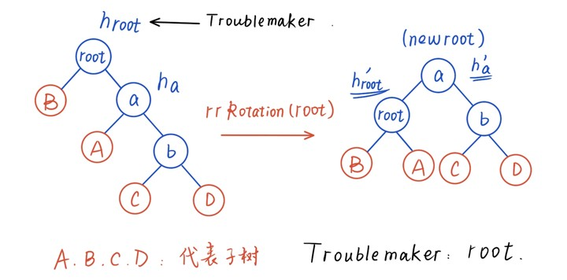
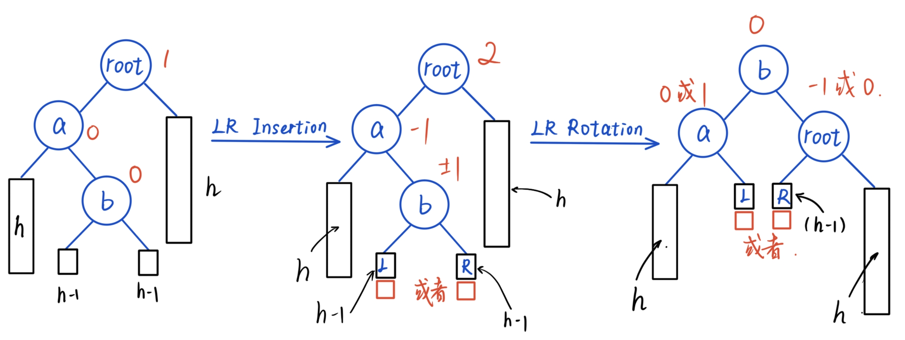
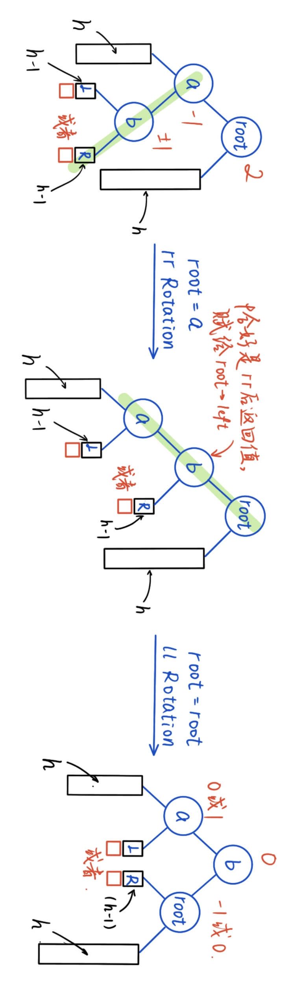

本文将依照张国川老师的授课以及其余材料整理。

其中涉及的代码我手搓了一遍，放在了GitHub仓库：[Grapesea/ADS_code](https://github.com/Grapesea/ADS_code)里面.

# 课程大纲 & Grading Policies

> 数据结构：（占$\dfrac13$） 
>
> * Balanced Search Trees: AVL Tree, Splay Tree, B+ Tree, Red-Black Tree
> * Leftist Heaps, Skew Heaps, Binomial Queue
> * Inverted File Index（看起来简单实则极易丢分）
>
> 算法：
>
> * Divide & Conquer
> * Backtracking, Dynamic Programming
> * Greedy Algorithms, Local Search
> * NP-Completeness, Approximation Algorithms
> * Randomized Algorithms, Parallel Algorithms
> * Streaming Algorithm (External Sorting)
>
> Grading Policy：（平时分60'，不溢出）
>
> * 作业10'
> * 讨论10'
> * Project 30' (2-3人，Presentation)
> * MidTerm(10*，可以被Final Term覆盖)
>
> * Final Term (40*)
>

<br/>

## Week 1: AVL Tree & Splay Tree & Amortized Analysis （摊还分析）

### AVL Tree

#### 定义

主要思想：尽可能平衡

Definition:

(1)An empty binary tree is height balanced. 

(2)If T is a nonempty binary tree with $T_L, T_R$ as its left and right subtrees, then $T$ is height balanced iff :

* $T_L, T_R$ are height balanced;
* $ \vert h_L-h_R \vert \leq 1$  where $h_L,h_R$ are the heights of $T_L,T_R$, respectively.

Define balance factor $BF(node) = h_L-h_R$. In an AVL tree, $BF(node) = \pm1,0$.

以上是判断是否为AVL tree的方法.

于是我们先写出一些关于height的定义：

```c++
struct AVLNode{
    int data;
    int height;
    AVLNode* left;
    AVLNode* right;
};

int getheight(AVLNode* node){
    if(node == nullptr) return 0;
    return node->height;
}

void updateheight(AVLNode* node){
    if (node == nullptr) return;
    node->height = 1 + max(getheight(node->left),getheight(node->right));
}

int calcBalanceFactor(AVLNode* node){
    if(node == nullptr) return 0;
    return (getheight(node->left) - getheight(node->right));
}
```

<br/>

#### 四种Rotation

> 旋转的理解：按我个人来看，这四种旋转都是需要先找到"Trouble Maker",即从插入的节点出发，一直向上走**第一个不平衡的节点。然后，对这个节点做操作**，具体可以看下面的代码实现。另外，LR与RL其实是由LL与RR组成的。
>
> （摘自[AVL树,Splay树,红黑树与B+树 - Starstone3's bed](https://starstone3.github.io/incourse/ADS/Tree/#avl树的特点与性质)）

RR Rotation: 如果新插入一个元素在右子树的最右节点，导致破坏了AVL Tree（$h_R-h_L = 2$），则需要进行Rotation，将root的右节点旋转成为root.

```c++
AVLNode* rrRotation(AVLNode* root){  
    // root 是第一个出问题的节点，即troublemaker
    if (root == nullptr || root->right == nullptr){
        return root;
    }
    AVLNode* newroot = root->right;
    root->right = newroot->left;
    newroot->left = root;
    updateheight(root);
    updateheight(newroot);  //先root后newroot，因为newroot的更新需要使用root的新数据.
    return newroot;
}
```

<center></center>

LL Rotation类似，代码如下：

```c++
AVLNode* llRotation(AVLNode* root){
    if (root == nullptr || root->left == nullptr){
        return root;
    }
    AVLNode* newroot = root->left;
    root->left = newroot->right;
    newroot->right = root;
    updateheight(root);
    updateheight(newroot);
    return newroot;
}
```

<br/>

接下来是LR Rotation：

<center></center>

这个rotation过程可以看作是一次RR Rotation和一次LL Rotation的叠加，如下：

<center></center>

所以代码为：

```c++
AVLNode* lrRotation(AVLNode* root){
    if (root == nullptr || root->left == nullptr){
        return root;
    }
    root->left = rrRotation(root->left);
    return llRotation(root);
}
```

类似地，RL Rotation为：

```c++
AVLNode* rlRotation(AVLNode* root){
    if (root == nullptr || root->right == nullptr){
        return root;
    }
    root->right = llRotation(root->right);
    return rrRotation(root);
}
```


### Splay Tree


