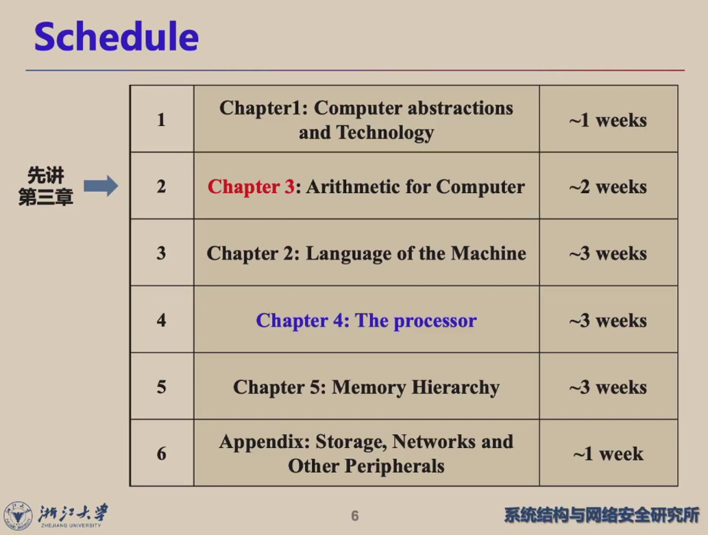

本文将依照林芃老师授课以及教材等材料进行整理.

# 课程大纲 & Grading Policies

Outline：

2024秋冬版本Grading Policy：

* 平时 20%： Homework, Check-in, Reading

* exam 10+40%：
  * Mid 10%
  * Final 40%，斩杀线40分

* lab 30%： 
  * lab 00-03: 基本实验，30%
  * lab 04: 单周期CPU，30%
  * lab 05: 流水线CPU，40%
  * 附加分：优秀作品额外bonus

## Week 1

## Week 2 