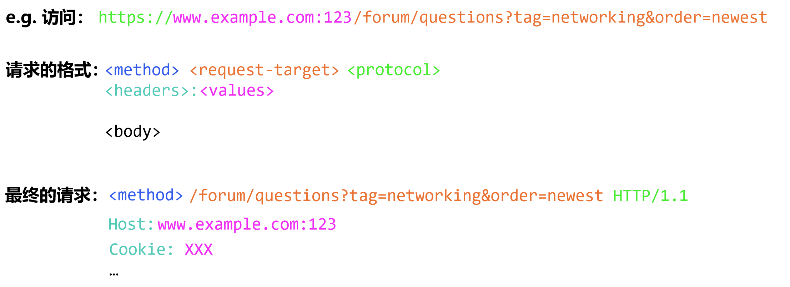
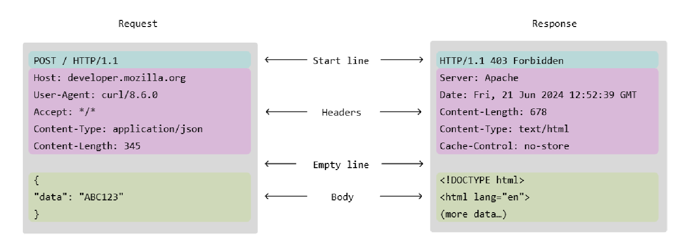

*以下笔记绝大部分来自lab和Slides，版权归对应教师/授课学长所有。*


# 课程Schedule

<center></center>

<center></center>

## Lec 0 Start(常瑞老师 & Lotus)

AAA概述，CTF概述.

**Homework 0**  在7.8之前完成**lab0**并重新提交.

---

## Lec 1 WEB (OverJerry)

**Overview**

> 1.基础
>
> 1.1 网络通信原理
>
> 1.2 前端与后端(HTML/JavaScript/PHP极速入门)
>
> 2.Web漏洞简介(原理+漏洞实例)
>
> *2.1 后端漏洞
>
> *2.2 前端漏洞
>
> 3.测试技术
>
> 4.总结 

---

### 网络通信原理

#### 网络传输原理

传输单位：数据包，传输过程：层级传递

传输的不同层级上具备不同**协议**


OSI七层模型：

<center></center>

TCP/IP 四层模型：

<center></center>

* 功能上来说，主要分为两大部分，首先是理解数据（应用层），其次是传输数据（网络接口层）
* 日常生活中常见协议： HTTP DNS SSH（应用层） TCP IP UDP（网络接口层）

<center></center>

* DNS服务是将域名转化成IP地址的服务，是应用层协议，举例：

  ```powershell
  PS C:\Windows\system32> nslookup www.zju.edu.cn 8.8.8.8
  服务器:  dns.google
  Address:  8.8.8.8
  
  非权威应答:
  名称:    www.zju.edu.cn.queniusa.com
  Addresses:  2001:da8:20d:40d3:3::3f8
            2001:da8:20d:40d3:3::3f7
            222.192.187.242
            222.192.187.244
            222.192.187.246
            222.192.187.243
            222.192.187.240
            222.192.187.241
            222.192.187.245
            222.192.187.248
  Aliases:  www.zju.edu.cn
            www.zju.edu.cn.w.cdngslb.com
  
  PS C:\Windows\system32> nslookup www.zju.edu.cn 10.10.0.21
  服务器:  dns1.zju.edu.cn
  Address:  10.10.0.21
  
  名称:    www.zju.edu.cn
  Address:  10.203.4.70
  ```

  以上是我在自己电脑上跑出来的结果，分别为公网DNS服务器和校内DNS服务器。

  <br/>

* 传输层靠端口实现多路复用

  端口(port)的取值范围介于0与65535之间，一个端口对应一个进程/服务，带上端口的地址通常标记为`ip:port`例如，一台ip地址为`10.24.123.123`的主机， `10.24.123.123:80`和`10.24.123.123:135`可以对应不同的服务，同时处理不同的连接。  

  注意：具体的服务是应用层的内容，端口只保证一台主机可以同时进行多个传输且不互相干扰。

* 很多常见的服务运行在特定的端口上，比如：
  FTP 21；SSH 22；HTTP 80；HTTPS 443；SMB 445；RDP 3389

  这些端口是默认补全的，比如使用了http协议且不加端口，则默认使用80端口。

  <br/>

TCP&UDP协议：

* TCP(传输控制协议, Transmission Control Protocol)
  * 面向连接、可靠、基于字节流    
  * 传输前会先建立一个端口到端口的连接，其中发送和接收是独立的(可以同时收发信息)
  * HTTP等协议基于TCP，通常由服务器监听一个TCP端口，等待客户端连接。连接后借助双向通信通道收发信息

* UDP(用户数据包协议, User Datagram Protocol)
  * 无连接、不可靠、低开销

  * 简而言之是发出就算数，常用于低延迟场景，如视频会议、物联网小数据通信等

* 可以用`netstat –ano`命令查看本地开放的端口：

  ```powershell
  PS C:\Windows\system32> netstat -ano -a
  
  活动连接
  
    协议  本地地址          外部地址        状态           PID
    TCP    0.0.0.0:80             0.0.0.0:0              LISTENING       20084
  ```

  以上是电脑上跑出来的结果，省略了后面的一大串ip地址。

  <br/>

HTTP协议：

* 超文本传输协议(HyperText Transfer Protocol)，(通常)基于TCP。

* HTTP请求：

  e.g. 访问:   https://www.example.com:123/forum/questions?tag=networking&order=newest

  请求的格式: 

  ```html
  <method> <request-target> <protocol>
  <headers>:<values>
  <body>
  ```

  

  可以对照色块观察：其中$\textcolor{blue}{\text{< method >}}$是POST/GET，高中技术已讲过。


  <center></center>

<center></center>

* HTTP响应-status_code：

  1xx 信息响应请求已接收，正在继续处理

  2xx 成功-请求已成功接收、理解并接受

  3xx 重定向- 需要采取进一步的措施以完成请求

  4xx 客户端错误- 请求包含语法错误或无法完成

  5xx 服务器错误服务器未能完成明显有效的请求

<br/>


#### PHP 

<center></center>

<br/>

#### HTML

* 流程：
  1. 向Server发送请求，Server回复一个HTML  $\textcolor{orange}{(橙色)}$，调取外部资源$\textcolor{purple}{(紫色)}$；
  2. 页面加载完成后，JavaScript代码执行，发起一个GET请求到 `/api/getUsername?uid=137`，这是一个典型的AJAX调用，用于动态获取用户数据；
  3. 如果成功，对DOM (Document Object Model，web 上构成文档结构和内容的对象的数据表示) 进行修改$\textcolor{red}{(红色)}$，

<center></center>


<center></center>


#### 简要总结

<center></center>

​			<br/>

### 漏洞 

#### 前端漏洞

**逻辑漏洞（举例）**

1. **支付漏洞 eg**

   为了避免建造一个庞大的数据库以存储id和price流水，只传递id.

   由于第三方平台只存储了id，未存储price，因此client拦下来传递到temporary page的URL，如`..id=xxx&price=100`改成`&price=1`可以充分利用漏洞牟利.

   <br/>

   方法：加一个hash值用以检验.

   但也有方法绕过，看[这个真实案例](https://hackerone.com/reports/1295844)，这实际上是因为：

   


2. **越权漏洞 eg**

   直接修改Request，看看能否获得别人的信息.

   越权修改：

<br/>


**注入漏洞（举例）**

1. 后端以为是数据，实际是命令

   eg. 用全球的site去ping某个服务器

   ```php+HTML
   system("ping " + $_POST["site"])
   ```

   正常输入 `www.zju.edu.cn`   执行：`ping www.zju.edu.cn`

   但此时如果利用Linux的命令分割符`||` 以构造恶意输入`|| rm –rf` 并执行：`ping || rm –rf`，则：
   实际执行`rm –rf`

   

   **可导致RCE(Remote Code Execution, 远程代码执行)**

   

2. SQL指令的不当拼接+解析 -> SQL注入

   > Hint: lab0 中sql注入题不计分，解法用到了逐bit爆破.


3. XML的不当拼接+解析

   LaTeX也可以不当解析（但听上去用overleaf可以避免这件事，只有放在本地的会被注入攻击）


4. SSRF

   


5. XSS

   跨站脚本：s

   如果把

   

   反射型XSS：

   数据没有被存储在服务器上，在传参时给出.

   

6. CSRF

   大多数能用CSRF_token防御.

   

7. 请求走私

   “粘包”

   <center></center>

   


#### 后端漏洞


### 测试技术

#### 参数污染

脏数据 etc.

<br/>


### Burpsuite使用备忘

> 此章节全部引用自 [Intercepting HTTP traffic with Burp Proxy - PortSwigger](https://portswigger.net/burp/documentation/desktop/getting-started/intercepting-http-traffic)，侵删。

#### Intercepting a request

Burp Proxy lets you intercept HTTP requests and responses sent between Burp's browser and the target server. This enables you to study how the website behaves when you perform different actions.

##### Step 1: Launch Burp's browser

Go to the **Proxy > Intercept** tab.

Set the intercept toggle to **Intercept on**.

<center></center>

Click **Open Browser**. This launches Burp's browser, which is preconfigured to work with Burp right out of the box.

Position the windows so that you can see both Burp and Burp's browser.

##### Step 2: Intercept a request

Using Burp's browser, try to visit `https://portswigger.net` and observe that the site doesn't load. Burp Proxy has intercepted the HTTP request that was issued by the browser before it could reach the server. You can see this intercepted request on the **Proxy > Intercept** tab.

<center></center>

The request is held here so that you can study it, and even modify it, before forwarding it to the target server.

##### Step 3: Forward the request

Click the **Forward** button to send the intercepted request. Click **Forward** again to send any subsequent requests that are intercepted, until the page loads in Burp's browser. The **Forward** button sends all the selected requests.

##### Step 4: Switch off interception

Due to the number of requests browsers typically send, you often won't want to intercept every single one of them. Set the intercept toggle to **Intercept off**.

<center></center>

Go back to the browser and confirm that you can now interact with the site as normal.


##### Step 5: View the HTTP history

In Burp, go to the **Proxy > HTTP history** tab. Here, you can see the history of all HTTP traffic that has passed through Burp Proxy, even while intercept was switched off.

Click on any entry in the history to view the raw HTTP request, along with the corresponding response from the server.

<center></center>

This lets you explore the website as normal and study the interactions between Burp's browser and the server afterward, which is more convenient in many cases.


## Lec 2 Misc (Dremig)


<br/>


<center><font color="#FF0000"><b>E.N.D.</b></font></center>


