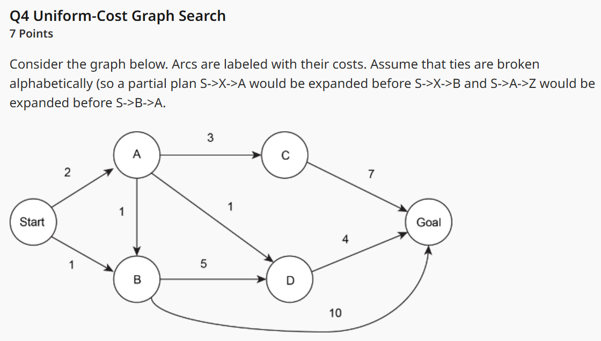
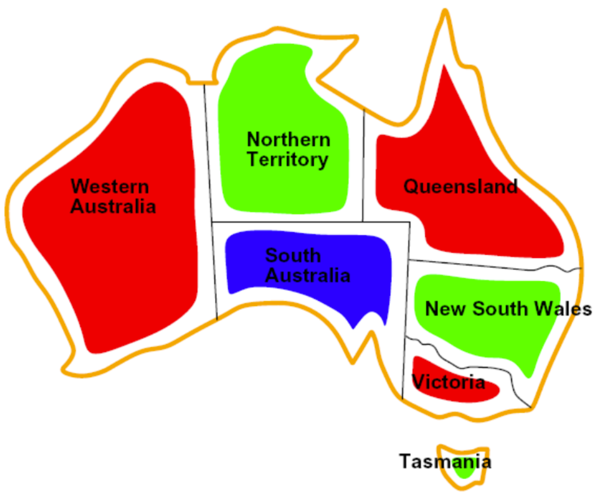
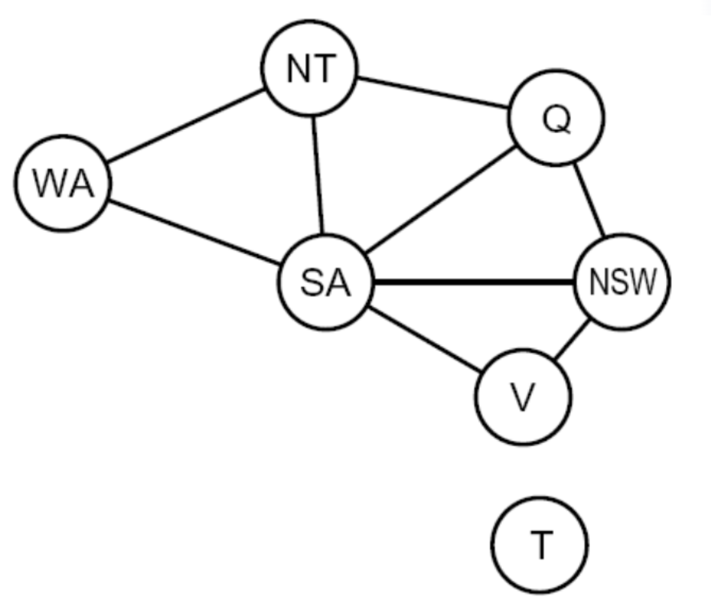
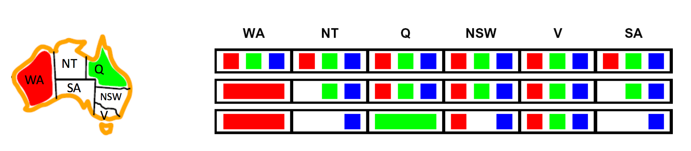
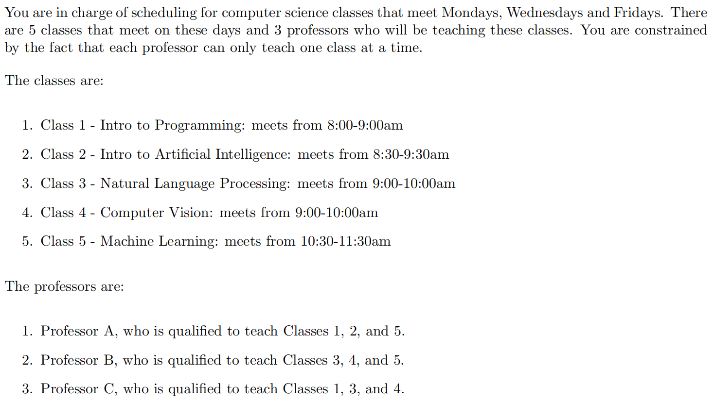
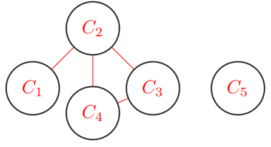

>课程网址：[CS 188 Spring 2025 Introduction to Artificial Intelligence at UC Berkeley](https://inst.eecs.berkeley.edu/~cs188/sp25/)
>
>Notes地址：[Introduction to Artificial Intelligence](https://inst.eecs.berkeley.edu/~cs188/textbook/)
>
>这是课程网站存档，虽然不会立刻失效，但是还是要加紧学习，毕竟AI技术迭代太快了。

# 课程Calendar


> 为了个人理解方便，部分pseudocode是按Python的格式写的，如有错误请指正.
>
> 中英混搭是为了个人理解方便，虽然全篇看起来就跟说梦话一样.

## Week1-Intro & Uninformed Search

> [1.3 Uninformed Search \| Introduction to Artificial Intelligence](https://inst.eecs.berkeley.edu/~cs188/textbook/search/uninformed.html)
>
> 对应的是FDS课程的Depth-First Search, Breadth-First Search, Uniform-Cost Search内容.

* Depth-First Search: 

  last in first out, selects the *deepest* frontier node from the start node for expansion.

* Breadth-First Search: 

  first in first out, selects the *shallowest* frontier node from the start node for expansion.

  It prioritizes the expansion of shallow nodes. Therefore, the search **always returns a path with the smallest number of edges.**

* Uniform Cost Search: 

  always selects the *lowest cost* frontier node from the start node for expansion.

  It prioritizes the expansion of paths with low costs in the fringe. Therefore, the search **always returns a path with the lowest cost.**

<br/>

* The general pseudocode for tree/graph search:

  ```pseudocode
  function TREE-SEARCH(problem, frontier) return a solution or failure
      frontier ← INSERT(MAKE-NODE(INITIAL-STATE[problem]), frontier)
      while not IS-EMPTY(frontier) do
          node ← POP(frontier)
          if problem.IS-GOAL(node.STATE) then return node
          for each child-node in EXPAND(problem, node) do
              add child-node to frontier
      return failure
  ```

  The expand function:

  ```pseudocode
  function EXPAND(problem, node) yields nodes
      s ← node.STATE
      for each action in problem.ACTIONS(s) do
          s' ← problem.RESULT(s, action)
          yield NODE(STATE=s', PARENT=node, ACTION=action)
  ```

  <br/>

* Annalysis:

  We suppose that there are  $\textcolor{red}{b}$ nodes in the second layer, and if the depth +1, the number of nodes $\times b$.

  The goal is on the $\textcolor{red}{s}$ tier, and and maximum depth is $\textcolor{red}{m}$.

  In UCS, we define the optimal path cost as $\textcolor{red}{C^∗}$ and the minimal cost between two nodes in the state space graph as $\textcolor{red}{\epsilon}$.

|                        | DFS      | BFS      | UCS                           |
| ---------------------- | -------- | -------- | ----------------------------- |
| Completeness（完备性） | ×        | √        | √                             |
| Optimality（最优性）   | ×        | ×        | √                             |
| Time Complexity        | $O(b^m)$ | $O(b^s)$ | $O(b^{\frac{C^*}{\epsilon}})$ |
| Space Complexity       | $O(bm)$  | $O(b^s)$ | $O(b^{\frac{C^*}{\epsilon}})$ |

<br/>

Three strategies above are fundamentally the same - differing only in expansion strategy, so they share the pseudocode above.

> ##### TIP: UCS example
>
> <center></center>
>
> | step       | 1                  | 2                                 | 3                                               | 4                                                 | 5                                                    | 6                                        | 7                 |
> | ---------- | ------------------ | --------------------------------- | ----------------------------------------------- | ------------------------------------------------- | ---------------------------------------------------- | ---------------------------------------- | ----------------- |
> | expand     | S                  | S-B                               | S-A                                             | S-A-D                                             | S-A-C                                                | pop S-B-D                                | S-A-D-G           |
> | fringe     | (S-A, 2), (S-B, 1) | (S-A, 2), (S-B-D, 6), (S-B-G, 11) | (S-B-D, 6), (S-B-G, 11), (S-A-D, 3), (S-A-C, 5) | (S-B-D, 6), (S-B-G, 11), (S-A-C, 5), (S-A-D-G, 7) | (S-B-D, 6), (S-B-G, 11), (S-A-D-G, 7), (S-A-C-G, 12) | (S-B-G, 11), (S-A-D-G, 7), (S-A-C-G, 12) | Nothing to fringe |
> | closed set | S                  | S,B                               | S,B,A                                           | S,B,A,D                                           | S,B,A,D,C                                            | S, B, A, D, C                            | S, B, A, D, C, G  |
>
> Return: Start-A-D-Goal
{: .block-tip }

<br/>

## Week 2 A* Search & Heuristic

> [1.4 Informed Search \| Introduction to Artificial Intelligence](https://inst.eecs.berkeley.edu/~cs188/textbook/search/informed.html)
>
> [1.5 Local Search \| Introduction to Artificial Intelligence](https://inst.eecs.berkeley.edu/~cs188/textbook/search/local.html)

* Heuristic：似乎翻译成"启发式的". 

  Heuristic function: 启发式函数$h(n)$，用于给出当前到达目标的预测成本.

  回忆一下UCS，这是一种基于当前累计成本的搜索方法。优先选择使累积成本函数$g(n)$最小的路径；而Greedy Search是基于Heuristic function给出的搜索方法，优先选择使启发函数$h$下降最快的路径.

  这里引入的A* Search的定性是a combination of greedy search and UCS，定义了综合函数$f(n) = g(n)+h(n)$，每次优先选择其中$f(n)$最小的那条路径进行搜索.

* A* isn't optimal，即非最优化的失效情形：如果heuristic远高于实际所需最低成本，那么不可能成功.

  相对地，if A* is optimal, then $h(n)$ is admissible, fulfilling the rule that: $$0 \leq h(n) \leq h^*(n)$$，其中$h^*(n)$是当前位置离目标实际上的最短路线距离.

找到合适的heuristics是A*算法应用的核心.

<br/>

* 最优性定理及证明：A\* Search is optimal when $h(n)$ is admissible.

  首先假设有两个目标$A, B$，其中$A$是主要的目标，$B$是次要目标，即$f(A)<f(B) \Longrightarrow g(A) < g(B)$.

  现在假设fringe上有一个元素$n$，则由$$\begin{cases} f(A) = g(A) + h(A) = g(A) \\ f(n) = g(n) + h(n) \leq g(n)+h^*(n) = f(A)\end{cases} \Longrightarrow f(n) \leq f(A) < f(B)$$

  于是可以知道$A$一定在$B$之前被遍历到，所以是optimal的.

* A*搜索的伪代码：

  ```pseudocode
  function A*-GRAPH-SEARCH(problem, frontier)
      reached ← an empty dict mapping nodes to the cost to each one
      frontier ← INSERT((MAKE-NODE(INITIAL-STATE[problem]),0), frontier)
      while not IS-EMPTY(frontier):
          node, node.CostToNode ← POP(frontier)
          if problem.IS-GOAL(node.STATE): return node
          if node.STATE not in reached or reached[node.STATE] > node.CostToNode:
              reached[node.STATE] = node.CostToNode
              for child-node in EXPAND(problem, node):
                  frontier ← INSERT((child-node, child-node.COST + CostToNode), frontier)
      return False
  ```

* Dominance定义： If heuristic $a$ is dominant over heuristic $b$, then the estimated goal distance for a is greater than the estimated goal distance for b for every node in the state space graph. Mathematically,

  $$\forall n, h_a(n) \geq h_b(n)$$

  这里$a$对$b$形成了dominant的关系，因为$a$是接近$h^*$的一种刻画.

  平凡启发式函数：The **trivial heuristic** is defined as $h(n)=0$, and using it reduces A* search to UCS.

  半格结构：

  ```bash
  exact (精确启发式)
           |
     max(h_a, h_b) (最大值组合)
        /     \
      h_a      h_b (具体的启发式函数)
       |        /
      h_c      /    
       \      /
        zero (平凡启发式)
  ```

  这里给我们指出了一个方法，对于某一问题的多个方案所构建的$h_1,h_2,\cdots,h_n$，取其中的max，仍然是heuristic的，我们可以通过这样的方法去逐步趋近exact。

* A* Search的失效和consistent heuristic的引入：

  现在的约束条件仍然存在不足，比如下面的情形中，A* Search就失效了。所以我们还需要引入新的概念consistent heuristic function：

  如果对某个graph，其中所有的节点$n$都满足：$$h(n) \leq c(n,n_{child})+h(n_{child})$$，则称这是一个consistent heuristic function.

  证明：略. easy

  <br/>

让Claude 4.0 Sonnet来总结一下这四种搜索：

> ##### TIP: 四种搜索的总结
>
> * DFS（深度优先搜索）
>
>   DFS采用"一条路走到黑"的策略。从起始节点开始，沿着一个分支尽可能深入，直到无法继续为止，然后回溯到上一个节点，探索其他分支。
>
>   **实现方式**：通常使用栈（或递归调用栈）来记录路径 
>
>   **时间复杂度**：$O(V+E)$，其中$V$是顶点数，$E$是边数 
>
>   **特点**：内存占用相对较少，但不保证找到最短路径
>
> * BFS（广度优先搜索）
>
>   BFS采用"逐层扩展"的策略。从起始节点开始，先访问所有相邻的节点，然后再访问这些节点的相邻节点，形成一圈一圈向外扩展的模式。
>
>   **实现方式**：使用队列来存储待访问的节点 
>
>   **时间复杂度**：$O(V+E)$ 
>
>   **特点**：在无权图中能保证找到最短路径，但内存占用较大
>
> * Greedy（贪心算法）
>
>   贪心算法在每一步都选择当前看起来最好的选项，基于某种启发式函数做出局部最优决策。在路径搜索中，通常选择距离目标最近的节点作为下一步。
>
>   **实现方式**：通常使用优先队列，按照启发式函数值排序 
>
>   **时间复杂度**：取决于具体实现，一般为$O(V \log V)$ 
>
>   **特点**：速度快，但不保证找到最优解
>
> * A*算法
>
>   A*结合了Dijkstra算法的准确性和贪心算法的效率。它使用评估函数$f(n) = g(n) + h(n)$，其中$g(n)$是从起点到当前节点的实际代价，$h(n)$是从当前节点到目标的启发式估计代价。
>
>   **实现方式**：使用优先队列，按$f(n)$值排序，维护开放列表和关闭列表 
>
>   **时间复杂度**：取决于启发式函数的质量，最坏情况为$O(b^d)$ 
>
>   **特点**：当启发式函数满足可接受性条件时，能保证找到最优解
>
> * 应用场景对比
>   * **DFS**：适合深层搜索、拓扑排序、强连通分量查找
>   * **BFS**：适合最短路径问题、层序遍历
>   * **Greedy**：适合对速度要求高、对最优性要求不严格的场景
>   * **A***：适合游戏AI、路径规划等需要在效率和最优性之间平衡的应用
>
>   这四种算法各有优势，选择哪种取决于具体的问题需求和约束条件。
{: .block-tip }

<br/>

## Week 2&3 CSPs

> [CSPs \| Introduction to Artificial Intelligence](https://inst.eecs.berkeley.edu/~cs188/textbook/csp/)

### 简介

CSPs: Constraint Satisfaction Problems

* 定义：我们考虑其中的三个重要因素：
  1. Variables: $N$个变量构成的一个set: $\{x_1,x_2,\cdots,x_N\}$(each take on a single value from some defined set of values);
  2. Domain: 一个set: $\{x_1,x_2,\cdots,x_N\}$可以代表一个CSP情况中的所有$x_i$可能值构成的所有情况;
  3. Constraints: 对变量本身的约束以及变量之间关系的约束.

* 举例：N皇后问题（在一个$N\times N$的棋盘上，放置N个国际象棋中的皇后，有多少种放置方法使得她们之间不能相互攻击？）

  在这个CSP问题中，可以这样定义：

  1. Variables: $X_{ij}, 0\leq i,j \leq N$

  2. Domain: $X_{ij} \in \{0,1\}$，其中$X_{ij}=0$指的是$(i,j)$这个格子上没有皇后，=1表示有皇后放置.

  3. Constraints: $\sum_{i,j}X_{i,j} = N$，并且对于$\forall i,j,k$，有以下约束：

     $$ \begin{cases}(X_{ij},X_{ik})\in \{(0,0),(0,1),(1,0)\}\\(X_{ij},X_{kj})\in \{(0,0),(0,1),(1,0)\}\\ (X_{ij},X_{i+k,j+k})\in \{(0,0),(0,1),(1,0)\}\\ (X_{ij},X_{i+k,j-k})\in \{(0,0),(0,1),(1,0)\}\end{cases} $$

  N皇后问题是一个NP问题.

* 举例：四色问题（地图染色问题）

  首先把地图上的每个区域以及他们的相邻关系抽象成无向图，比如对澳大利亚进行这样粗暴的划分：

  <center></center>

  <center></center>

  转换成常用的graph等数据类型之后再进行深入讨论.

  <br/>

### backtracking search

  Backtracking 是对DFS的优化，遵循以下两个方面的原则：

  1. 对所有元素排序并按照这样的顺序进行赋值. 由于$\{x_1,x_2,\cdots,x_N\}$地位相同可交换，所以不妨设排序就是$x_1>x_2>\cdots>x_N$；
  2. 选取某个变量的值时，选取不会与先前确定的变量值冲突的可能value，如果全都冲突，则回到上一个确定下来的变量并改变它的值.

* CSPs的Backtracking算法伪代码：

  ```pseudocode
  function Backtracking-Search(CSP) returns solution/failure
  	return recursive-backtracking({},CSP)
  
  function recursive-backtracking(assignment,csp)
  	if assignment complete:
  		return assignment
  	var = Select-Unassigned-Variable
  	for value in order-domain-values(var,assignment,csp):
  		if value consistent with the assignment given constraints:
  			add {var = value} to assignment 
  			result = recursive-backtracking(assignment,csp)
  			if result != failure: return result
  			remove {var = value} from assignment
  	return failure
  ```

  Backtracking = DFS + variable-ordering + fail-on-violation （回溯 = 深度优先搜索 + 变量排序 + 冲突即失败）

  <br/>

* Backtracking的改进方法1：Filtering

  移除已知会导致回溯的值，提前剪除未分配变量的域的大小（概括一下就是剪枝）。其中的一种简单方法是前向检查，即分配给$X_i$值之后，剪除与 $X_i$ 有约束且分配后会违反约束的未分配变量的域.

  用地图染色问题来举例，考虑下面的情况：

  <center></center>

  先后分配WA,Q的颜色后，NT,SA,NSW的域缩小.

  前向检查的思想可以推广为弧一致性的原则. 对于弧一致性，我们将约束图中的每个无向边解释为两个指向相反方向的有向边. 这些**有向边中的每一条被称为一条弧**.

  弧一致性 (Arc Consistency) 算法的工作原理如下：

  1. 将所有arc存入priority queue `Queue​`中；
  2. 将`Queue`中的arc递归式地移除，保证每个被移除的弧$X_i\rightarrow X_j$都有：对于尾变量$X_i$的每个剩余值$ v$，头变量$X_j$至少有一个剩余值$w$满足$ X_i=v $，$ X_j=w $不会违反任何约束。如果$ X_i $的某个值$ v$与$ X_j $的任何剩余值都不兼容，就将$v $从$X_i$的可能值集合中移除；
  3. 设此时所有未赋值的点构成集合为$\{x_k\}$，如果移除了$X_i\rightarrow X_j$的某个值，那么需要将所有弧$X_k \rightarrow X_i, \forall X_k \in \{x_k\}$放置回`Queue`中；
  4. 继续操作直到`Queue`变空，或者某个变量的域变空引发backtracking.

  Filtering一般使用AC-3算法实现，伪代码：

  ```pseudocode
  function AC-3(CSP) returns the CSP
  	initial queue, csp 
  	// a binary CSP with variables{x1,x2,…,xn} and all arcs in queue
  	while queue not empty:
  		(xi,xj) = remove_first(queue)
  		if remove_inconsistent_values(xi,xj): // xi is tail, xj is head
  			for xk in neighbors[xi]:
  				queue.append((xk,xi))
  
  function remove_inconsistent_values(xi,xj):
  	moved = False
  	for x in domain(xi):
  		if any y in domain(xj) unsatisfy the constraint xi<->xj:
  			delete x from domain(xi)
  			removed = True
  	return removed
  ```

  最坏情况时间复杂度：$O(ed^3), e: \text{number of the arc edges}, d: \text{the maximum size of the domain}$.

  一些限制：留下的解法数量是不确定的，可能返回0,1或N>1种解法，返回0时可能是遗漏了一些方法.

  

  <br/>

* 接下来考虑上述的顺序如何确定：

  引入两个参数，minimum remaining values (MRV) 和 least constraining value (LCV)，**前者针对下一个variable的选择，后者针对单个variable的value选取**.
  
  * MRV: chooses whichever unassigned variable has the **fewest valid remaining values** (the *most constrained variable*). This is intuitive in the sense that the most constrained variable is most likely to run out of possible values and result in backtracking if left unassigned, and so it’s best to assign a value to it sooner than later.
  
    选取下一个进行修改的变量时，选择剩余有效值最少的那个变量，因为最容易出现backtracking，所以要先处理.
  
  * LCV: select the value that **prunes the fewest values from the domains** of the remaining unassigned values. Notably, this requires additional computation (e.g. rerunning arc consistency/forward checking or other filtering methods for each value to find the LCV), but can still yield speed gains depending on usage.
  
    选取值时，从域中选择本身限制最少的那个值，这样剔除的值最少.

* 延申：k-Consistency

  $k = 1$: Node Consistency，即每个节点的域中所有的值必须满足unary constraints.

  $k = 2$: Arc Consistency，即弧一致性.

  对$k$进行归纳，k-Consistency是指对于任意$k$个节点，每个$k-1$-Consistency都能拓展到第$k$个节点上.

  Strong k-Consistency: 此时**不需要使用backtracking**，因为
  
  <br/>
  
* Structures

  如果我们遇到的是无向无环图，那么可以认为是Tree，此时我们可以将寻找到solution的时间复杂度从

  $O(d^n)$压缩到$O(nd^2)$，用到的是以下的Tree-structured CSP Algorithm:

  1. 任意选取一个节点作为Root;
  2. 进行Topological Ordering；
  3. 


> ##### TIP: CSP eg. - Course Scheduling, regular discussion 2
>
> <center></center>
>
> 1. Formulate this problem as a CSP problem in which there is one variable per class, stating the domains (after enforcing unary constraints), and binary constraints. Constraints should be specified formally and precisely, but may be implicit rather than explicit.
>
>    Variables : $C_1,C_2,C_3,C_4,C_5$
>
>    Domains (Unary Constraints) : $$\{A,B,C\} \Longrightarrow C_1: \{A,C\}, C_2:\{A\},C_3:\{B,C\},C_4:\{B,C\},C_5:\{A,B\}$$
>
>    Constraints (Binary) : $C_1 \neq C_2, C_2 \neq C_3, C_2 \neq C_4, C_3 \neq C_4$.
>
>    
>
> 2. Draw the constraint graph associated with your CSP.
>
>    总之这道题不需要想复杂化，只需要考虑某几节课如果给同一个老师，时间段就不能重叠，以此来考虑Binary Constraints即可.
>
>    <center></center>
>
{: .block-tip }

摘自examprep2的练习：

1. When enforcing arc consistency in a CSP, the set of values which remain when the algorithm terminates does not depend on the order in which arcs are processed from the queue. $\textcolor{red}{\checkmark}$

   $\textcolor{red}{原因：AC-3算法的最终结果是唯一的}$

2. Once arc consistency is enforced as a pre-processing step, forward checking can be used during backtracking search to maintain arc consistency for all variables. $\textcolor{red}{\times}$

3. In a general CSP with $n$ variables, each taking $d$ possible values, the worst case time complexity of enforcing arc consistency using the AC-3 method discussed in class is $\textcolor{red}{O(n^2d^3)}$.

4. In a general CSP with $n$ variables, each taking $d$ possible values, the maximum number of times a backtracking search algorithm might have to backtrack (i.e. the number of the times it generates an assignment, partial or complete, that violates the constraints) before finding a solution or concluding that none exists is $\textcolor{red}{O( d^n)}$.

   

5. The maximum number of times a backtracking search algorithm might have to backtrack in a general CSP
   if it is running arc consistency and applying the MRV and LCV heuristics is $\textcolor{red}{O( d^n)}$.

### Local Search


总结：

Backtracking算法是针对CSPs的有效方法，其中


## Week 3&4 Game Trees


<br/>

## Week 4&5 MDPs


<br/>

## Week 5&6 RL


<br/>

## Week 6 Probability


<br/>

## Week 7&8 Bayes Nets


<br/>

## Appendix: Logic

> [Logic](https://inst.eecs.berkeley.edu/~cs188/textbook/logic/)

10.1这段话非常生动，摘录于此（中文是自己手动翻译的）：

> Imagine a dangerous world filled with lava, the only respite a far away oasis. We would like our agent to be able to safely navigate from its current position to the oasis.
>
> 想象一个离一片绿洲不远，但却充满岩浆的危险环境。现在我们希望我们的agent能够从当前位置安全地抵达绿洲。
>
> In reinforcement learning, we assume that the only guidance we can give is a reward function which will try to nudge the agent in the right direction, like a game of ‘hot or cold’. As the agent explores and collects more observations about the world, it gradually learns to associate some actions with positive future reward and others with undesirable, scalding death. This way, it might learn to recognize certain cues from the world and act accordingly. For example, if it feels the air getting hot it should turn the other way.
>
> 在强化学习中，我们设定唯一能给予的引导是一个能将agent推向正确方向的奖励函数，就像"hot or cold"游戏的玩法一样（详见[Hot and Cold game - How to play ? - Party Games 4 Kids](https://partygames4kids.com/hot-and-cold-game)）。当agent在探索中获得了对这个世界的些许洞察后，它会逐步将可能获得的收益或者负面乃至烫伤致死的后果与某些行为联系在一起。在这样的情况下，它将学会辨别这个世界给予的诸多线索，并作出相应的举动。比如，如果感受到周围的空气正在升温，那么它将会调转方向前进。
>
> However, we might consider an alternative strategy. Instead, let’s tell the agent some facts about the world and allow it to reason about what to do based on the information at hand. If we told the agent that air gets hot and hazy around pits of lava, or crisp and clean around bodies of water, then it could reasonably infer what areas of the landscape are dangerous or safe based on its readings of the atmosphere. This alternative type of agent is known as a **knowledge-based agent**. Such an agent maintains a **knowledge base**, which is a collection of logical **sentences** that encode what we have told the agent and what it has observed. The agent is also able to perform **logical inference** to draw new conclusions.
>
> 然而，我们也可以考虑另一种策略。与先前不同的是，我们可以将世界上的许多事实告知给agent，并且让它基于已知事实推理出下一步该做什么。如果我们告诉agent，空气在熔岩坑的附近会变得又热又浑浊，而在水源附近会变得清凉洁净，那么它可以依据对周围空气状态的识别，合理推断出某片区域安全与否。这种agent类型我们称之为知识库驱动的agent。它拥有知识库，一个将我们事先告诉它的知识以及它观察到的知识编码成逻辑语句的庞大集合。它还能通过逻辑推理，给出新的结论。

10.2：温习一下英语

> $\neg$ : `\neg`, not 
>
> $\lor$: `\lor`, or, aka "disjunction"
>
> $\land$: `\land`, and , aka "conjunction"
>
> $\Rightarrow$: `\Rightarrow`, implication
>
> $\Leftrightarrow$: `Leftrightarrow`, biconditional

10.3: Propositional Logic

> Propositions: 陈述/命题
>
> 
>
> 


