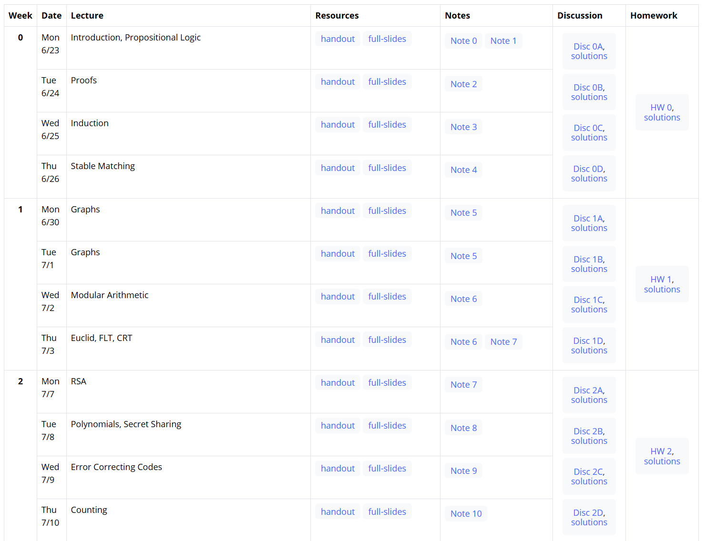
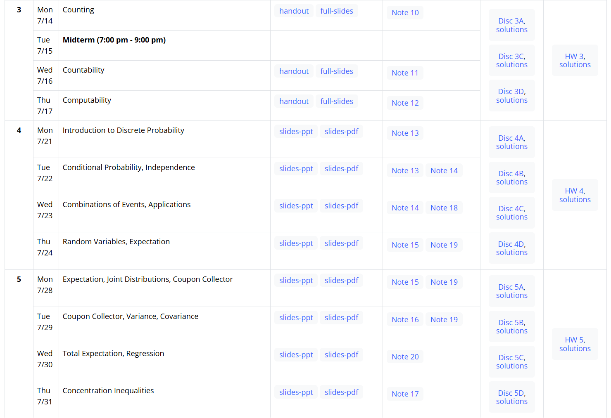
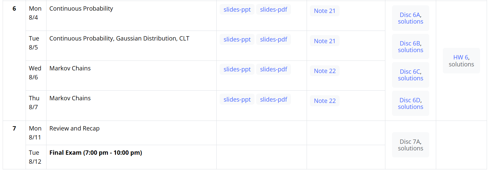

>课程网页：[CS 70 Summer 2025](https://www.eecs70.org/)
>
>此课程网页没有存档的说法，如果2025Summer结束，可能会刷新至2025Autumn，因此需要在暑假加紧学习！

# 课程Calendar

## Week 0

### Propositional Logic

* $p \land q$: logical AND

  $p \lor q$: logical OR

  $\Longrightarrow$: implies

* When some () embrace definations and list one by one, the last one is conclusion and above are assumptions.

  eg. $$(\forall x\in\mathbb{Z})\ (\ (((x\in\mathbb{N})\vee(x<0))\wedge\neg((x\in\mathbb{N})\wedge(x<0)))\ .$$

  $$(\forall x\in\mathbb{N})\ ((6\mid x)\implies((2\mid x)\vee(3\mid x))).$$

  eg. $\forall x \exists y P(x,y) \Longrightarrow \exists y \forall x P(x,y) ~~ (\times)$

  ​	  $ \exists y \forall x P(x,y) \Longrightarrow  \forall x \exists y P(x,y) ~~ (√)$

* Truth table

  eg. $(p\lor q)\land r \equiv (p\land r) \lor (q \land r) ~~ (√)$

 

### Stable matching

首先明确几个定义：

* matching: Disjoint set of $(c_i, j_i)$ pairs that are matched together.

* Rogue couple: a pair$ (c, j)$ not in the matching that prefers each other over their current matchings

  $(c,j')$and $(c',j)$.

* Stable Matching: A matching without rogue couple.

Propose and reject algorithm:

* Each job proposes to its favorite candidate that hasn’t rejected it;

* Each candidate rejects all but their favorite job (which they “put on a string”);

* Each rejected job crosses out rejecting candidate from its list; 

* Stop when all candidates have a job on a string.

## Week 1

